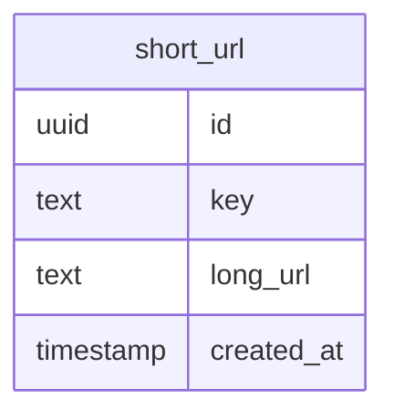
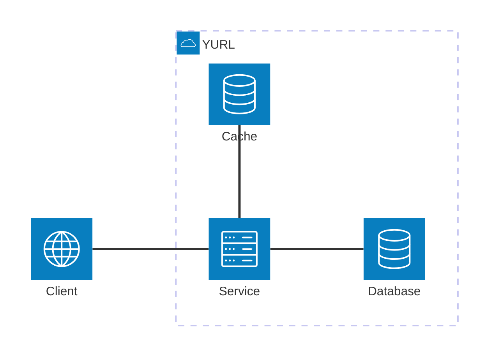
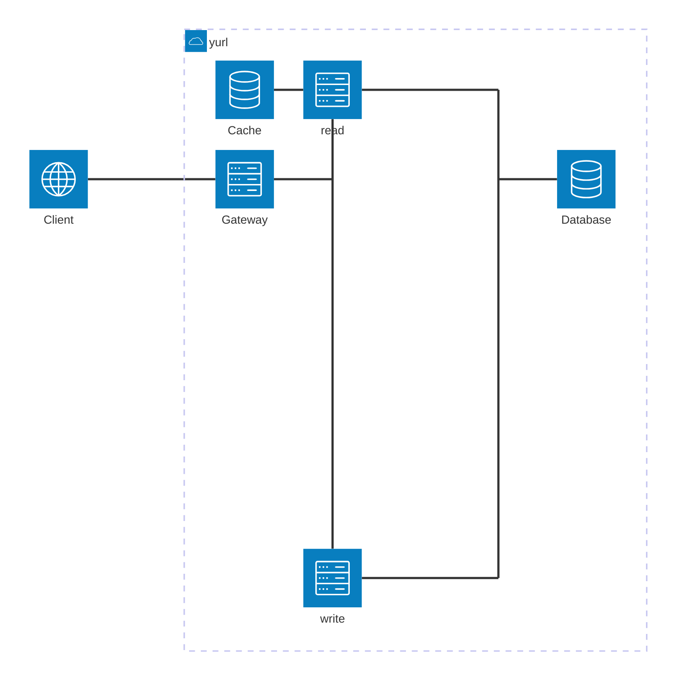

# Yurl

URL Shortening service.

## Building & Running

To build or run the project, use one of the following tasks:

| Task                          | Description                                                          |
| ------------------------------|--------------------------------------------------------------------- |
| `./gradlew test`              | Run the tests                                                        |
| `./gradlew build`             | Build everything                                                     |
| `buildFatJar`                 | Build an executable JAR of the server with all dependencies included |
| `buildImage`                  | Build the docker image to use with the fat JAR                       |
| `publishImageToLocalRegistry` | Publish the docker image locally                                     |
| `./gradlew run`               | Run the server                                                       |
| `runDocker`                   | Run using the local docker image                                     |

If the server starts successfully, you'll see the following output:

```
2024-12-04 14:32:45.584 [main] INFO  Application - Application started in 0.303 seconds.
2024-12-04 14:32:45.682 [main] INFO  Application - Responding at http://0.0.0.0:8080
```

### Interacting with Docker

To interact with the docker stacks, use `just` (or `make` alternatively).

When using `just`:
```sh

# view available recipes
just -l # or just --list

# get help on using a recipe
just --usage {recipe_name}

# to run recipes
just up {...arguments}

```

In general, for this project:
| Task                          | Description                                                          |
| ------------------------------|--------------------------------------------------------------------- |
| `just up local`               | Start the LOCAL docker stack.                                        |
| `just down local`             | Stop(down) LOCAL docker stack.                                       |
| `just up prodlike`            | Build an executable JAR of the server with all dependencies included |
| `just down prodlike`          | Build the docker image to use with the fat JAR                       |

## Design

Main points for consideration:

1. Gather Requirements
2. API Design / Database Design
3. High-Level system design
4. Deep dive / Relevant details

### Requirements

Functional Requirements (domain sourcing):
1. URL shortening - create a unique URL 
2. URL redirection
3. Link analytics (number of clicks)
4. Custom links instead of randomly generated characters

Non-functional requirements (technical):
* Minimize redirect latency—consider 301/302 status codes for cashing. This can interfere with analytics
* How many URLs should the system support?
  * Example 1B
  * We want 7 characters for keys, gives ~ 8b combinations (for 26 ascii characters)
* High-Read Low-Write service
* URL shortening strategy, how are keys created?
  * Explained in more detail below

### API Design

For the API design, there are two main endpoints:
1. One to create new short links—which is protected via an API key
2. One for redirection

```yaml
openapi: 3.0.3
info:
  title: Y-URL API
  version: 1.0.0

paths:
  /l:
    post:
      summary: Create a new short URL
      requestBody:
        required: true
        content:
          application/json:
            schema:
              type: object
              required:
                - url
              properties:
                url:
                  type: string
                  example: some-slug
      responses:
        "201":
          description: Short URL successfully created
          content:
            application/json:
              schema:
                type: object
                properties:
                  key:
                    type: string
                    example: abc123
        "401":
          description: Unauthorized – missing or invalid API key

  /l/{key}:
    get:
      summary: Retrieve a short URL and redirect
      parameters:
        - in: path
          name: key
          required: true
          schema:
            type: string
          description: Unique identifier for the short URL
      responses:
        "301":
          description: Moved Permanently
          headers:
            Location:
              description: Redirect target URL
              schema:
                type: string
                format: uri
        "302":
          description: Found (Moved Temporarily)
          headers:
            Location:
              description: Redirect target URL
              schema:
                type: string
                format: uri
```

### Database Design

For the database schema, it is really simple for the initial set of requirements.
A single lookup table is enough to store this information.



An index is created for `key` to increase lookup speeds.

### System Design

Characteristics:
* A key is 7 alphabetic characters, gives pool of 8b mappings.
* Given the database structure, we store:
  * 70 bytes at least per record, for 1b records that's ~70GB (minimum)
  * 36 (id) + 7 (key) + 19 (time) + ~8(db) + x(url)
* This is a high-read, low-write service -> should be optimized for reading.

#### Key creation strategies

* Use an incrementing counter and base62 encoding
  * This assumes the base62 alphabet is used for keys.
  * Each key creation the counter is incremented and that value is encoded with base62 resulting in the key.
  * Offers predictability.
  * If the service holds this counter in-memory, increasing the number of instances will create issues and collisions
  since each instance will start with a new counter (assuming it starts from 0).
  * To solve this Redis (or any other in-memory single threaded cache) can be used.
* (**Our pick**) Use a randomly generated string
    * Define an alphabet and use seeds or secure-random algorithms to generate keys.
    * Instances are stateless.
    * Small chances of collisions can be handled with retries.
* Hash input URL and slice length of the key
  * A hashing algorithm (md5, sha256) is applied once/twice to a URL and the first/last X characters are chosen
  * Offers predictability.
  * Instances are stateless
  * Collision handling is more complex since you have to keep track of how many times the URL was hashed

#### Suggested designs



* The overall design is straightforward and has a low cognitive load.
* To optimize for high-read, an in-memory cache is used. 
* Low fault tolerance, if the service is down, everything is unavailable.

---



* Separates creation and redirection into separate services to increase fault tolerance.
  * If creation is not working, redirection+analytics still works
* Still has the same benefits of the design above
* Increases cognitive load and deployment complexity

---

The second design can be improved even further by introducing a message queue into the write path.
In cases where the service is experiencing not only high read but high write situations, this can be an improvement.
This design introduces:
* High throughput on both paths
* Eventual consistency
* High cognitive load, high deployment complexity

How it works:
* A message queue is used to hand off write messages. The service generates a key, hands off the message
to the queue and returns, greatly increasing response times.
* A service sits in between the queue and the database. It consumes each message, one by one in order, processes
and stores them into the cache and the database achieving consistency.
* If this in-between service goes down, messages are stored in the queue and will be processed. This service should have
a backup instance running always and a rapid startup time.
